<p align="center">
  
</p>

<h1 align="center">🎪 EventZen — End-to-End Event Management Platform</h1>

<p align="center">
  <strong>A production-grade, polyglot microservices platform for managing events, bookings, payments, vendors, budgets, and attendee check-ins — built as a Deloitte Capstone Project.</strong>
</p>

<p align="center">
  
  
  
  
  
  
  
  
  
  
  
</p>

---

## 📑 Table of Contents

- [Project Overview](#-project-overview)
- [Architecture](#-architecture)
- [Tech Stack](#-tech-stack)
- [Microservices Breakdown](#-microservices-breakdown)
- [Features](#-features)
- [UI Screenshots](#-ui-screenshots)
- [Backend Flow Diagram](#-backend-flow-diagram)
- [Database Schema](#-database-schema)
- [API Documentation](#-api-documentation)
- [Security Implementation](#-security-implementation)
- [Event-Driven Architecture (Kafka)](#-event-driven-architecture-kafka)
- [Monitoring & Observability](#-monitoring--observability)
- [Performance Optimizations](#-performance-optimizations)
- [Project Structure](#-project-structure)
- [Getting Started](#-getting-started)
- [Environment Variables](#-environment-variables)
- [Docker Deployment](#-docker-deployment)
- [Testing](#-testing)
- [Contributing](#-contributing)

---
## 🎥 Project Demo
  
A complete walkthrough and live demonstration of the project is available here:

👉 [Project demo](https://drive.google.com/file/d/1rDNec_FGbi6mPk172mWIv7enF1M7d1nM/view?usp=sharing)

## 🌟 Project Overview

**EventZen** is a full-stack, cloud-ready event management platform that enables:

- **Admins** to create, manage, and publish events with vendor assignments, budget tracking, and attendee management
- **Vendors** to accept/decline event assignments, manage check-ins via QR code scanning, and track budgets
- **Customers** to browse events, book tickets (with multi-tier pricing), make payments via Razorpay, and receive real-time notifications

The platform is built with a **polyglot microservices architecture** — combining Java (Spring Boot), C# (.NET 10), and Node.js (Express) for backend services — all orchestrated via Docker Compose, secured with HashiCorp Vault, and interconnected through Apache Kafka for asynchronous event-driven communication.

---

## 🏗 Architecture

EventZen follows a **microservices architecture** with an API Gateway pattern, event-driven messaging, and secrets management via HashiCorp Vault.

### High-Level Architecture Diagram

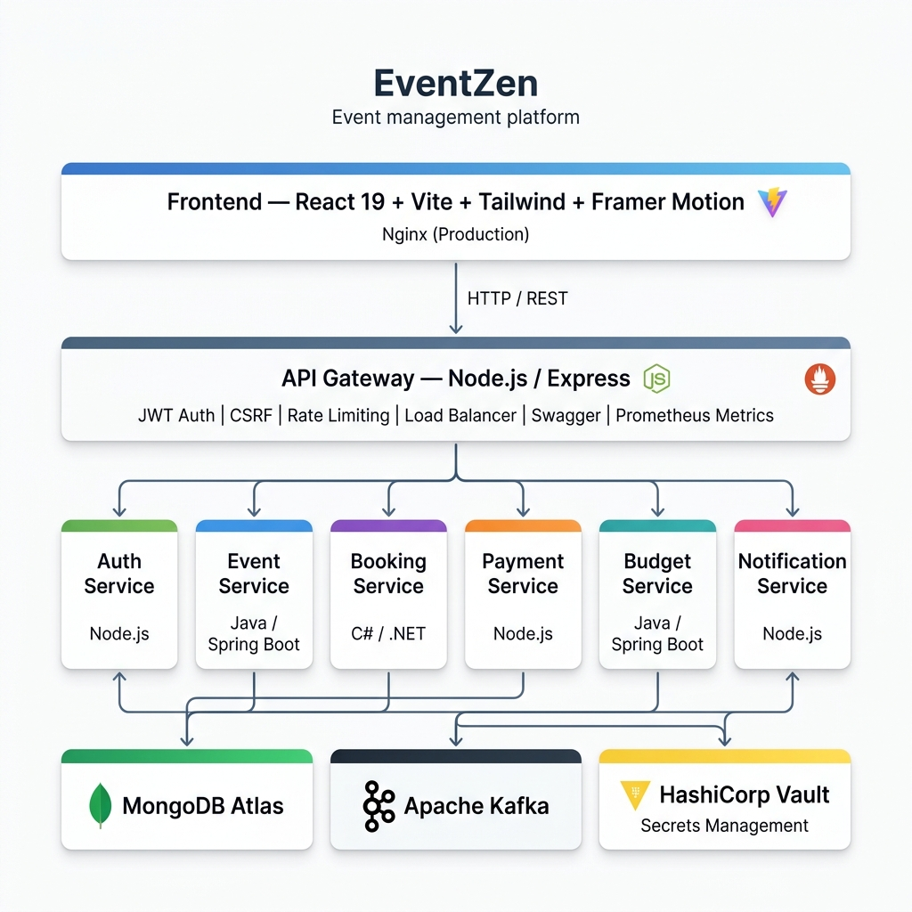
*EventZen microservices architecture — Frontend → API Gateway → 6 polyglot services → MongoDB / Kafka / Vault*

```
┌──────────────────────────────────────────────────────────────────┐
│                        FRONTEND (React 19)                       │
│            Vite + TailwindCSS 4 + ShadCN/UI + Framer Motion      │
│                        Nginx (Production)                        │
└────────────────────────────┬─────────────────────────────────────┘
                             │  HTTP / REST
                             ▼
┌───────────────────────────────────────────────────────────────────┐
│                      API GATEWAY (Node.js)                        │
│  Express + http-proxy-middleware │ JWT Auth │ CSRF │ Rate Limit   │
│  Load Balancer │ Response Cache │ Swagger UI │ Prometheus Metrics │
└────┬────────┬────────┬────────┬────────┬────────┬─────────────────┘
     │        │        │        │        │        │
     ▼        ▼        ▼        ▼        ▼        ▼
┌────────┐┌────────┐┌────────┐┌────────┐┌────────┐┌───────────────┐
│  Auth  ││ Event  ││Booking ││Payment ││ Budget ││ Notification  │
│Service ││Service ││Service ││Service ││Service ││   Service     │
│Node.js ││Java/SB ││.NET 10 ││Node.js ││Java/SB ││   Node.js     │
└───┬────┘└───┬────┘└───┬────┘└───┬────┘└───┬────┘└───────┬───────┘
    │         │         │         │         │             │
    └─────────┴─────────┴────┬────┴─────────┘             │
                             │                            │
                         ┌───▼───┐                    ┌───▼───┐
                         │MongoDB│◄── Kafka Topics ──►│ Kafka │
                         │ Atlas │                    │Broker │
                         └───────┘                    └───────┘
                                                          │
┌─────────────────────────────────────────────────────────┘
│                    HashiCorp Vault                      │
│     AppRole Auth │ KV v2 Secrets │ Vault Agent Sidecars │
└─────────────────────────────────────────────────────────┘
```

---

## 🛠 Tech Stack

### Frontend
| Technology | Purpose |
|---|---|
| **React 19** | UI library with Suspense & lazy loading |
| **Vite 7** | Build tool & dev server |
| **TailwindCSS 4** | Utility-first CSS framework |
| **ShadCN/UI (Radix)** | Headless UI components (Dialog, Select, Dropdown, Pagination, Calendar, Alert Dialog, OTP Input) |
| **Framer Motion** | Page transitions & micro-animations |
| **React Router DOM 7** | Client-side routing with AnimatePresence |
| **Axios** | HTTP client with interceptors |
| **Tanstack Table** | Data table management |
| **Leaflet + React Leaflet** | Interactive venue maps |
| **Lucide React** | Icon system |
| **Zod** | Client-side form validation |
| **html5-qrcode** | QR code scanner for vendor check-in |
| **qrcode + jsPDF + html2canvas** | QR ticket generation & PDF export |
| **react-hot-toast** | Toast notifications |
| **date-fns** | Date formatting utilities |
| **Vitest + Testing Library** | Unit & integration testing |

### Backend
| Service | Language / Framework | Port |
|---|---|---|
| **API Gateway** | Node.js 20 / Express 5 | `3000` |
| **Auth Service** | Node.js 20 / Express 5 | `3001` |
| **Event Service** | Java 17 / Spring Boot 3.2 | `8080` |
| **Booking Service** | C# / .NET 10 (ASP.NET Core) | `5000` |
| **Payment Service** | Node.js 20 / Express 5 | `3002` |
| **Budget Service** | Java 17 / Spring Boot 3.2 | `8081` |
| **Notification Service** | Node.js 20 / Express 5 | `3003` |

### Infrastructure & DevOps
| Technology | Purpose |
|---|---|
| **Docker & Docker Compose** | Containerization & orchestration (20+ containers) |
| **HashiCorp Vault** | Secrets management with AppRole auth & agent sidecars |
| **Apache Kafka (KRaft)** | Event-driven messaging (no ZooKeeper) |
| **MongoDB Atlas** | Cloud database (shared across services) |
| **Cloudinary** | Image upload & CDN (avatars, event/venue images) |
| **Razorpay** | Payment gateway integration |
| **Groq AI (LLaMA 3.3 70B)** | AI-powered event & venue description generation |
| **Nodemailer & MailKit** | Email services (OTP, booking confirmations, QR tickets) |
| **Swagger / OpenAPI** | API documentation |
| **Nginx** | Reverse proxy for frontend in production |

### Monitoring & Observability
| Technology | Purpose |
|---|---|
| **Prometheus** | Metrics collection from all services |
| **Grafana** | Dashboards & visualization |
| **prom-client** | Node.js metrics (API Gateway, Auth, Payment, Notification) |
| **Micrometer + Actuator** | JVM/Spring metrics (Event, Budget services) |
| **prometheus-net** | .NET metrics (Booking Service) |

---

## 🧩 Microservices Breakdown

### 1. API Gateway (`backend/api-gateway`)
- **Tech**: Node.js + Express 5
- **Responsibilities**:
  - Reverse proxy to all downstream services via `http-proxy-middleware`
  - JWT authentication & token verification middleware
  - CSRF protection with double-submit cookie pattern
  - Rate limiting (per-endpoint for auth routes + global API limiter)
  - Round-robin load balancer with health checks
  - Response caching (10s TTL for public GET endpoints)
  - Swagger UI at `/api-docs`
  - Prometheus metrics at `/metrics`

### 2. Auth Service (`backend/auth-service`)
- **Tech**: Node.js + Express + Mongoose
- **Responsibilities**:
  - User registration with OTP-based email verification
  - Login with JWT access + refresh token rotation
  - Password reset flow (forgot → OTP verification → reset)
  - Profile management (name, email change with OTP, avatar upload)
  - Role management (customer / admin / vendor)
  - Vendor role request & approval workflow
  - Cloudinary-based image upload (avatars + event media)
  - User bulk-lookup (internal service-to-service)

### 3. Event Service (`backend/event-service`)
- **Tech**: Java 17 + Spring Boot 3.2 + Spring Data MongoDB
- **Responsibilities**:
  - Full CRUD for Events, Venues, and Vendors
  - Event lifecycle: `draft` → `pending_vendor` → `published` → `cancelled`
  - Multi-tier ticket types (VIP, General, etc.) with per-type pricing & capacity
  - Vendor assignment & confirmation workflow (accept/decline)
  - AI-powered description generation via Groq API (LLaMA 3.3 70B)
  - Event filtering (status, date range, search, pagination)
  - Kafka event publishing for notifications
  - Capacity management & seat tracking

### 4. Booking Service (`backend/booking-service`)
- **Tech**: C# / .NET 10 (ASP.NET Core) + MongoDB Driver
- **Responsibilities**:
  - Event booking with ticket type selection
  - Booking lifecycle: `confirmed` → `checked_in` / `cancelled`
  - QR code generation for each booking (QRCoder library)
  - Email-based booking confirmations with QR attachment (MailKit)
  - QR-based check-in system for vendors
  - User booking history queries
  - Kafka event publishing for booking notifications

### 5. Payment Service (`backend/payment-service`)
- **Tech**: Node.js + Express + Razorpay SDK
- **Responsibilities**:
  - Razorpay order creation with convenience fee calculation
  - Payment verification (signature validation)
  - Revenue tracking & summary (convenience fee revenue per event)
  - Kafka event publishing for payment notifications

### 6. Budget Service (`backend/budget-service`)
- **Tech**: Java 17 + Spring Boot 3.2 + Spring Data MongoDB
- **Responsibilities**:
  - Budget creation & management per event
  - Expense line-item tracking (vendor costs, misc expenses)
  - Budget summary with total allocated vs. spent
  - Cross-service event data enrichment

### 7. Notification Service (`backend/notification-service`)
- **Tech**: Node.js + Express + KafkaJS
- **Responsibilities**:
  - Kafka consumer for all platform events
  - Notification persistence to MongoDB
  - Event-to-notification mapping (human-readable titles/messages)
  - Recipient resolution (admin, vendor, customer targeting)
  - User notifications API (list, mark-read, mark-all-read, delete)
  - Prometheus metrics for notification processing

---

## ✨ Features

### 🔐 Authentication & Authorization
- **OTP-Verified Registration** — 6-digit OTP via email with expiry & resend
- **JWT Authentication** — Access token + refresh token rotation
- **Role-Based Access Control** — Customer, Admin, Vendor roles with protected routes
- **Password Reset** — Forgot password → OTP → Secure reset flow
- **CSRF Protection** — Double-submit cookie pattern across all state-changing requests
- **Rate Limiting** — Per-endpoint (login, OTP) + global API rate limiting

### 🎫 Event Management
- **Full Event Lifecycle** — Draft → Pending Vendor → Published → Cancelled
- **AI-Powered Descriptions** — Auto-generate event/venue descriptions via Groq (LLaMA 3.3)
- **Multi-Tier Tickets** — VIP, General, Early Bird with per-type pricing & capacity limits
- **Event Media** — Multiple image uploads via Cloudinary
- **Smart Filtering** — Search, date range, status, and paginated browsing
- **Event Approval** — Admin review and rejection with reason tracking

### 🏢 Venue Management
- **Venue CRUD** — Create, edit, delete venues with capacity, address & images
- **Interactive Maps** — Venue location display via Leaflet integration
- **AI Descriptions** — Auto-generate venue descriptions

### 👥 Vendor Workflow
- **Vendor Registration** — Users can request vendor role; admin approves
- **Event Assignment** — Admin assigns vendor during event creation with agreed cost
- **Accept / Decline** — Vendors can accept or decline event assignments
- **QR Check-In Scanner** — Vendors scan attendee QR codes for real-time check-in

### 💳 Payments
- **Razorpay Integration** — Secure payment gateway with order creation
- **Convenience Fee** — Configurable platform fee percentage
- **Payment Verification** — Cryptographic signature validation
- **Revenue Dashboard** — Admin view of convenience fee revenue per event

### 📋 Bookings
- **Ticket Selection** — Choose from multi-tier ticket options
- **QR Code Ticket** — Auto-generated QR code for each booking
- **Email Confirmation** — Booking confirmation email with embedded QR
- **PDF Export** — Download ticketed tickets as PDF
- **Booking History** — View all past and upcoming bookings

### 🔔 Notifications
- **Real-Time Notifications** — Kafka-driven event-based notifications
- **Notification Types** — Booking confirmed, vendor assigned, event published, etc.
- **Notification Panel** — Dropdown panel with unread count badge
- **Notifications Page** — Full page with filtering, pagination, mark-read
- **Staggered Animations** — Smooth entry animations for notification items

### 📊 Admin Dashboard
- **Summary Cards** — Total events, venues, vendors, bookings at a glance
- **Revenue Analytics** — Convenience fee revenue tracking
- **Events Table** — Manage all events with status filters
- **Venues Grid** — Visual venue management
- **Vendors Table** — Vendor management with approval workflow
- **Bookings Table** — Cross-event booking overview
- **Attendee Management** — Per-event attendee list with check-in status
- **Budget Management** — Per-event budget tracking with expense items

### 👤 User Profile
- **Profile Management** — Update name, email (with OTP verification)
- **Avatar Upload** — Cloudinary-powered avatar management
- **Password Change** — Secure password update with old password verification
- **Account Deletion** — Self-service account deletion with confirmation

---

## 📸 UI Screenshots

> **Note:** Replace the placeholder paths below with actual screenshots captured from the running application.

### Landing Page
<!-- 📌 INSERT LANDING PAGE SCREENSHOT -->
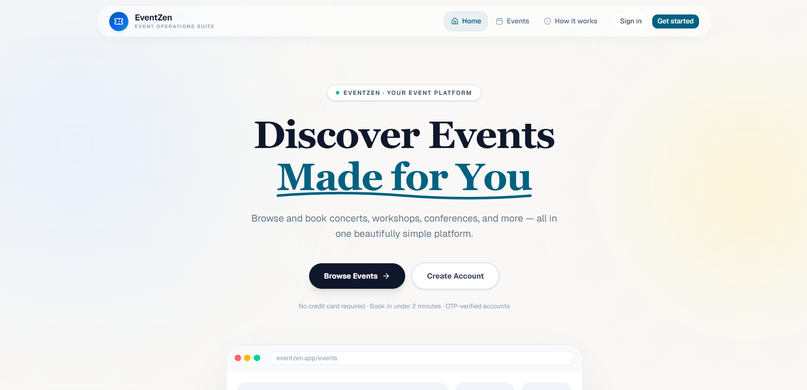
*The landing page with hero section, how-it-works flow, features showcase, and testimonials*

---

### Authentication
<!-- 📌 INSERT AUTH SCREENSHOTS -->

| Login | Register | OTP Verification |
|---|---|---|
| 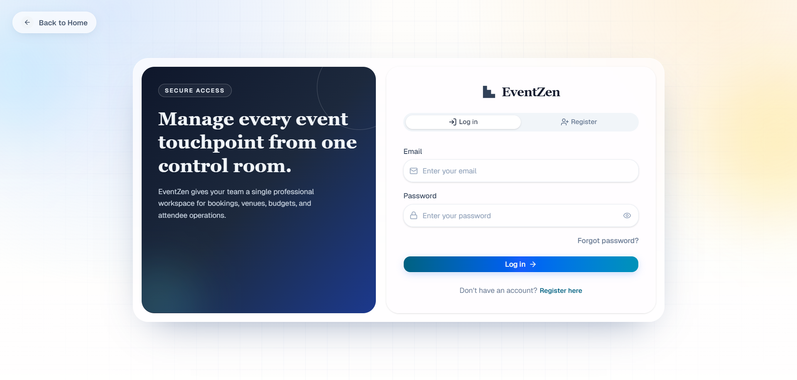 | 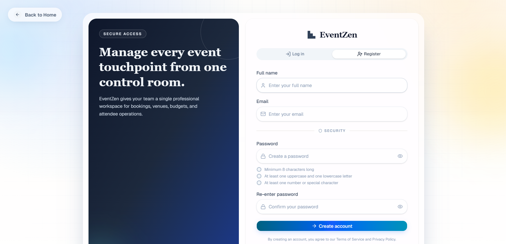 | 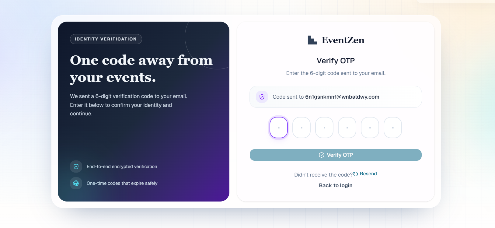 |

*Login form, registration with role selection, and email OTP verification*

---

### Events Browsing (Customer View)
<!-- 📌 INSERT CUSTOMER EVENTS SCREENSHOT -->
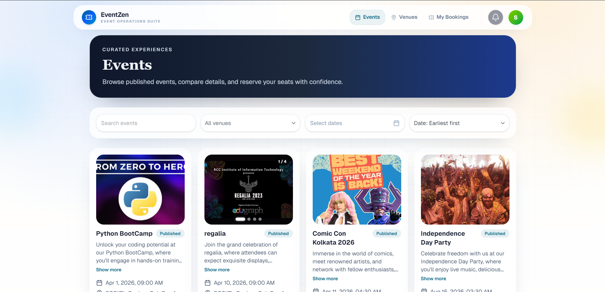
*Public events page with search, filters, and paginated event cards*

---

### Event Details & Booking
<!-- 📌 INSERT EVENT DETAILS SCREENSHOT -->
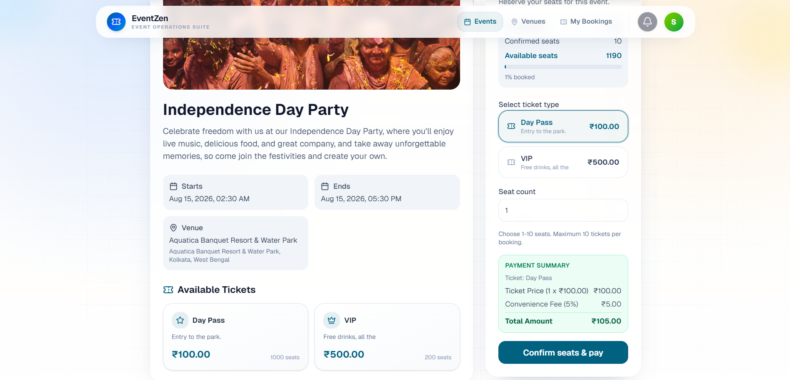
*Event detail page with image carousel, ticket tier selection, and booking panel*

---

### My Bookings
<!-- 📌 INSERT MY BOOKINGS SCREENSHOT -->
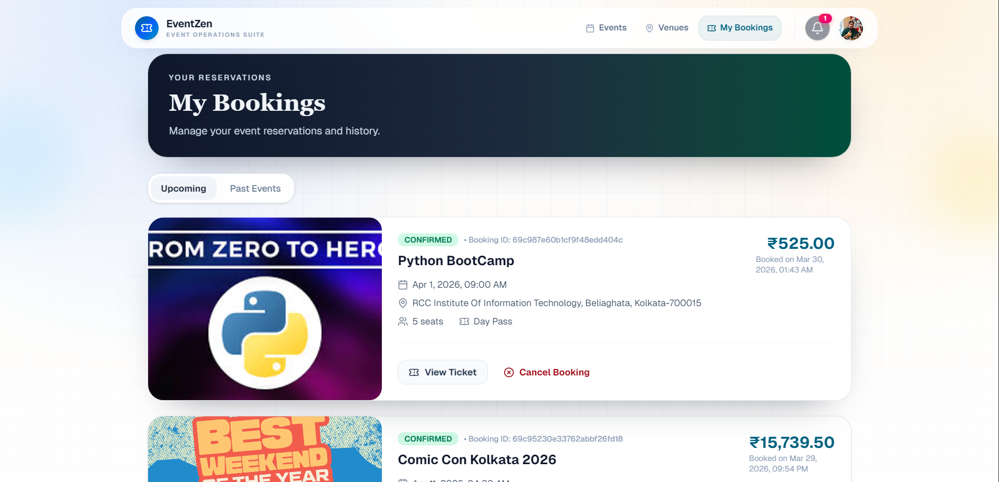
*User bookings page showing confirmed tickets with QR codes and PDF download*

---

### User Profile
<!-- 📌 INSERT PROFILE SCREENSHOT -->
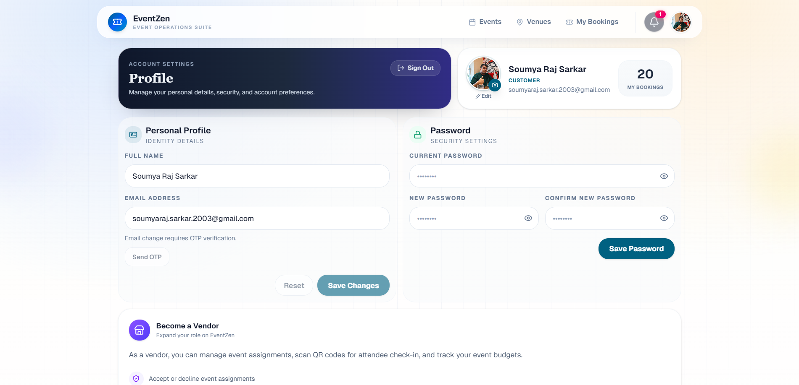
*Profile page with personal info form, avatar upload, email change OTP flow, and password change*

---

### Notifications
<!-- 📌 INSERT NOTIFICATIONS SCREENSHOTS -->

| Notification Panel | Notifications Page |
|---|---|
| 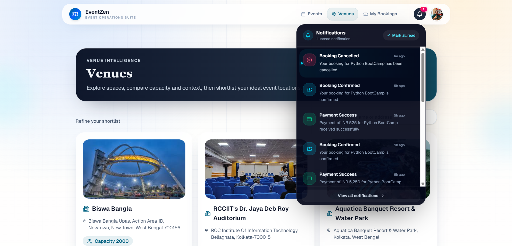 | 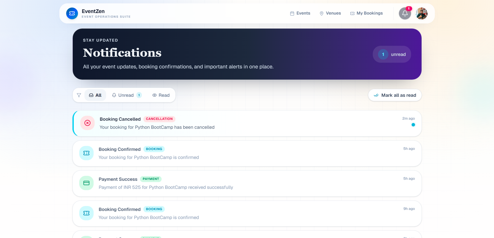 |

*Navbar notification dropdown with unread badge and the full notifications page with filtering*

---

### Admin Dashboard
<!-- 📌 INSERT ADMIN DASHBOARD SCREENSHOT -->
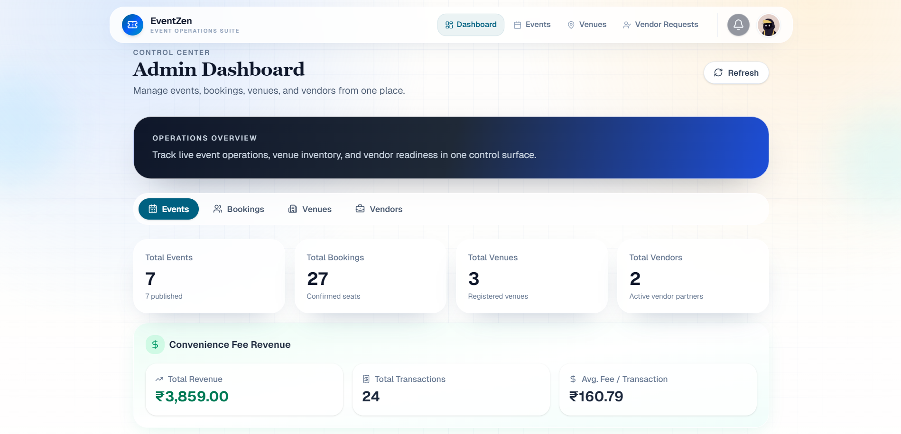
*Admin dashboard with summary cards, revenue analytics, tabbed sections for events/venues/vendors/bookings*

---

### Admin Event Creation
<!-- 📌 INSERT EVENT CREATION SCREENSHOT -->
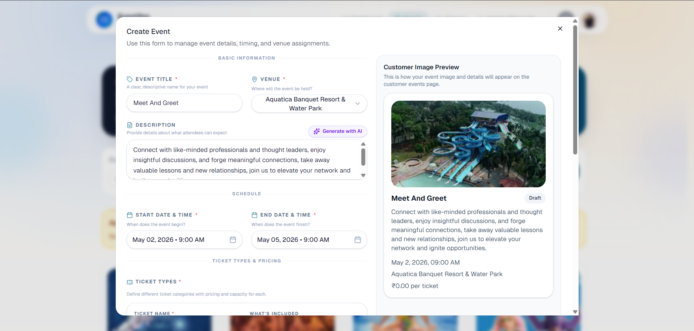
*Event creation dialog with venue selection, date picker, ticket tiers, vendor assignment, and AI description*

---

### Admin Events Management
<!-- 📌 INSERT ADMIN EVENTS SCREENSHOT -->
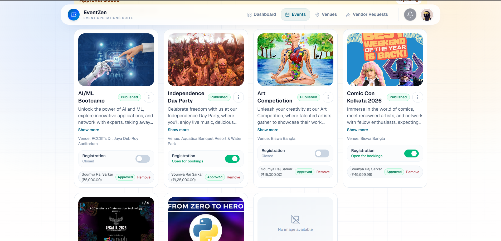
*Admin events table with status filter pills, lifecycle actions (publish, reject, cancel)*

---

### Admin Venues Management
<!-- 📌 INSERT ADMIN VENUES SCREENSHOT -->
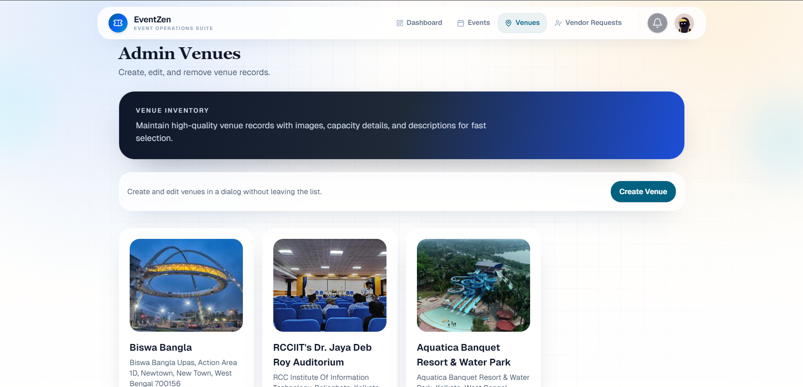
*Admin venues grid view with editing and AI description generation*

---

### Admin Budget Management
<!-- 📌 INSERT ADMIN BUDGET SCREENSHOT -->
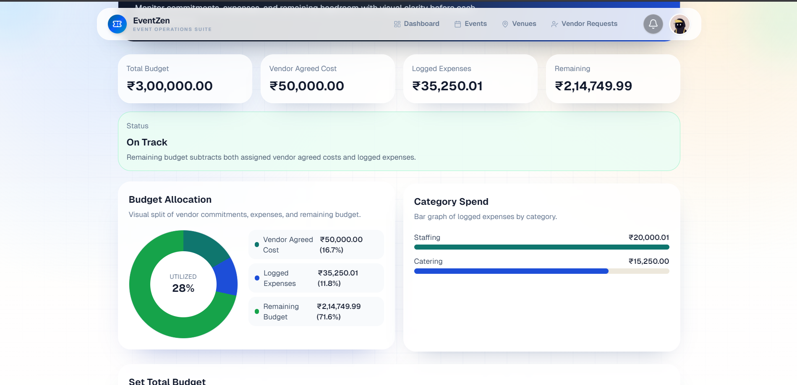
*Event budget tracker with vendor costs, expense line items, and budget summary*

---

### Vendor Check-In Scanner
<!-- 📌 INSERT VENDOR CHECKIN SCREENSHOT -->
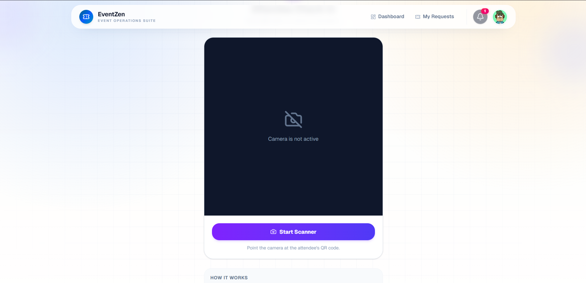
*QR code scanner for vendor-side attendee check-in with real-time validation*

---

### Payment Flow
<!-- 📌 INSERT PAYMENT SCREENSHOT -->
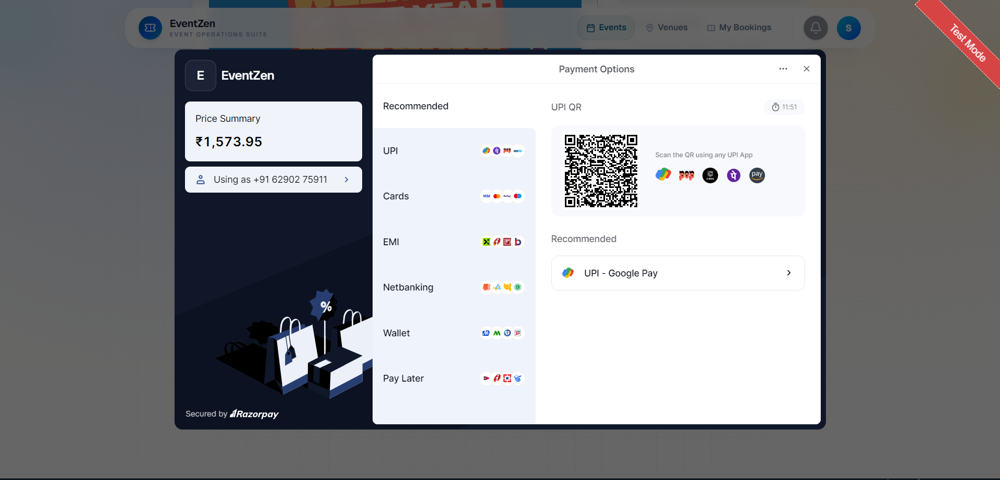
*Razorpay payment checkout modal with convenience fee breakdown*

---

### Venues Page
<!-- 📌 INSERT VENUES PAGE SCREENSHOT -->
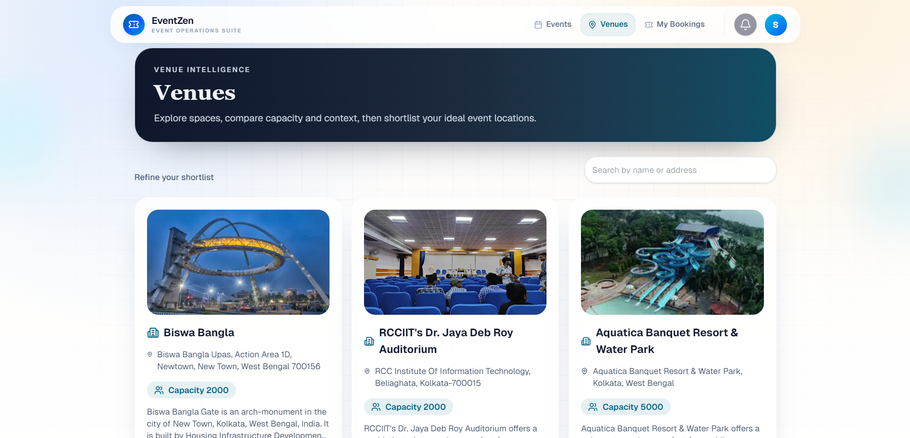
*Publicly browse venues with capacity info, maps, and image gallery*

---

## 🔄 Backend Flow Diagram

<!-- 📌 INSERT BACKEND FLOW DIAGRAM IMAGE HERE -->
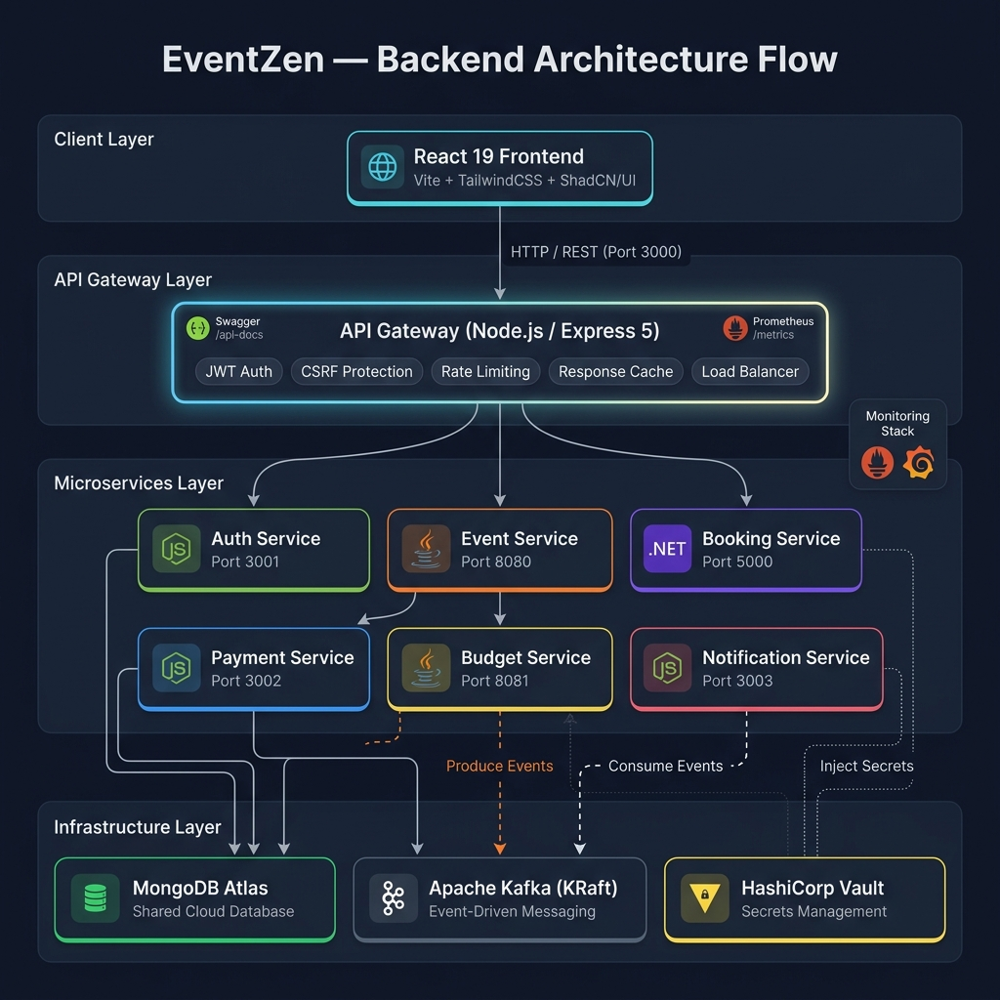
*Request lifecycle: Client → API Gateway (JWT + CSRF + Rate Limit) → Service → MongoDB Atlas / Kafka*

### Request Lifecycle

```
1. Client sends request to API Gateway (:3000)
2. API Gateway applies:
   ├── CORS validation
   ├── Rate limiting (per-endpoint + global)
   ├── CSRF token verification (for state-changing requests)
   ├── Response cache check (for GET requests)
   └── JWT authentication (extracts user info)
3. Request proxied to downstream service
4. Service processes request:
   ├── Business logic execution
   ├── MongoDB Atlas read/write
   ├── Kafka event publishing (if state change)
   └── Cross-service calls (if needed)
5. Notification Service consumes Kafka events
   ├── Maps event to user-friendly notification
   ├── Resolves recipient(s)
   └── Persists notification to MongoDB
6. Response returned through gateway to client
```

### Kafka Topics & Event Flow

```
eventzen-notifications (topic)
├── Producer: Event Service
│   ├── event.vendor_assigned
│   ├── event.vendor_accepted
│   ├── event.vendor_declined
│   ├── event.published
│   ├── event.rejected
│   └── event.cancelled
├── Producer: Booking Service
│   ├── booking.confirmed
│   └── booking.cancelled
├── Producer: Payment Service
│   └── payment.completed
├── Producer: Auth Service
│   └── auth.vendor_role_approved
└── Consumer: Notification Service
    └── Maps all events → in-app notifications
```

---

## 🗃 Database Schema

All services share a single **MongoDB Atlas** cluster with the following collections:

### Auth Service Collections
| Collection | Fields |
|---|---|
| `USERS` | `_id`, `name`, `email`, `password_hash`, `role` (`customer`/`admin`/`vendor`), `vendorRoleStatus` (`none`/`pending`/`approved`), `isVerified`, `avatar`, `otp`, `otpExpiresAt`, `emailChangePendingEmail`, `emailChangeOtp`, `created_at` |
| `REFRESH_TOKENS` | `_id`, `userId`, `token`, `expiresAt` |

### Event Service Collections
| Collection | Fields |
|---|---|
| `events` | `_id`, `venueId`, `createdBy`, `title`, `description`, `startTime`, `endTime`, `ticketPrice`, `maxAttendees`, `imageUrls[]`, `ticketTypes[]` (id, name, price, capacity), `status`, `budget` (totalBudget, agreedVendorCost), `vendors[]` (vendorId, userId, agreedCost, status), `approvedBy`, `rejectionReason`, `registrationOpen` |
| `venues` | `_id`, `name`, `address`, `capacity`, `description`, `imageUrls[]`, `createdAt` |
| `vendors` | `_id`, `userId`, `name`, `contactEmail`, `serviceType`, `createdAt` |

### Booking Service Collections
| Collection | Fields |
|---|---|
| `bookings` | `_id`, `user_id`, `event_id`, `seat_count`, `ticket_type_id`, `ticket_type_name`, `status` (`confirmed`/`checked_in`/`cancelled`), `booked_at`, `checked_in_at`, `checked_in_by` |

### Payment Service Collections
| Collection | Fields |
|---|---|
| `conveniencefeerevenues` | `_id`, `eventId`, `totalFeeCollected`, `updatedAt` |

### Notification Service Collections
| Collection | Fields |
|---|---|
| `notifications` | `_id`, `userId`, `type`, `title`, `message`, `read`, `metadata`, `createdAt` |

---

## 📖 API Documentation

The API Gateway exposes a **Swagger UI** at:

```
http://localhost:3000/api-docs
```

### Key API Endpoints

#### Auth Service (`/api/auth/*`)
| Method | Endpoint | Auth | Description |
|---|---|---|---|
| `POST` | `/api/auth/register` | ❌ | Register new user |
| `POST` | `/api/auth/verify-otp` | ❌ | Verify email OTP |
| `POST` | `/api/auth/resend-otp` | ❌ | Resend verification OTP |
| `POST` | `/api/auth/login` | ❌ | Login (returns JWT) |
| `POST` | `/api/auth/refresh-token` | ❌ | Refresh access token |
| `POST` | `/api/auth/logout` | ❌ | Logout (revoke refresh token) |
| `POST` | `/api/auth/forgot-password` | ❌ | Request password reset OTP |
| `POST` | `/api/auth/verify-reset-otp` | ❌ | Verify reset OTP |
| `POST` | `/api/auth/reset-password` | 🔒 Reset Token | Reset password |
| `GET` | `/api/auth/csrf-token` | ❌ | Get CSRF token |
| `GET` | `/api/auth/me` | 🔒 JWT | Get current user profile |
| `PUT` | `/api/auth/me` | 🔒 JWT | Update profile |
| `POST` | `/api/auth/avatar` | 🔒 JWT | Upload avatar |
| `POST` | `/api/auth/media/images` | 🔒 JWT | Upload event/venue images |
| `POST` | `/api/auth/vendor-role/request` | 🔒 JWT | Request vendor role |
| `GET` | `/api/auth/vendor-role/requests` | 🔒 Admin | List vendor role requests |
| `PATCH` | `/api/auth/vendor-role/requests/:id/approve` | 🔒 Admin | Approve vendor request |
| `PATCH` | `/api/auth/users/:id/promote` | 🔒 Admin | Promote user role |

#### Event Service (`/api/events/*`)
| Method | Endpoint | Auth | Description |
|---|---|---|---|
| `GET` | `/api/events` | ❌ | List published events (paginated, filterable) |
| `GET` | `/api/events/:id` | ❌ | Get single event details |
| `POST` | `/api/events` | 🔒 Admin | Create new event |
| `PUT` | `/api/events/:id` | 🔒 Admin | Update event |
| `DELETE` | `/api/events/:id` | 🔒 Admin | Delete event |
| `PATCH` | `/api/events/:id/publish` | 🔒 Admin | Publish event |
| `PATCH` | `/api/events/:id/reject` | 🔒 Admin | Reject event with reason |
| `PATCH` | `/api/events/:id/cancel` | 🔒 Admin | Cancel event |
| `PATCH` | `/api/events/:id/vendor-accept` | 🔒 Vendor | Vendor accepts assignment |
| `PATCH` | `/api/events/:id/vendor-decline` | 🔒 Vendor | Vendor declines assignment |
| `POST` | `/api/events/generate-description` | 🔒 Admin | AI-generate event description |
| `GET` | `/api/venues` | 🔒 JWT | List all venues |
| `POST` | `/api/venues` | 🔒 Admin | Create venue |
| `PUT` | `/api/venues/:id` | 🔒 Admin | Update venue |
| `DELETE` | `/api/venues/:id` | 🔒 Admin | Delete venue |
| `POST` | `/api/venues/generate-description` | 🔒 Admin | AI-generate venue description |
| `GET` | `/api/vendors` | 🔒 JWT | List all vendors |

#### Booking Service (`/api/bookings/*`)
| Method | Endpoint | Auth | Description |
|---|---|---|---|
| `POST` | `/api/bookings` | 🔒 JWT | Create booking |
| `GET` | `/api/bookings/my` | 🔒 JWT | Get user's bookings |
| `GET` | `/api/bookings/event/:eventId` | 🔒 Admin/Vendor | Get event's bookings |
| `PATCH` | `/api/bookings/:id/cancel` | 🔒 JWT | Cancel booking |
| `POST` | `/api/bookings/check-in` | 🔒 Vendor | QR check-in |

#### Payment Service (`/api/payments/*`)
| Method | Endpoint | Auth | Description |
|---|---|---|---|
| `POST` | `/api/payments/create-order` | 🔒 JWT | Create Razorpay order |
| `POST` | `/api/payments/verify` | 🔒 JWT | Verify payment |
| `GET` | `/api/payments/revenue-summary` | 🔒 Admin | Get revenue summary |

#### Notification Service (`/api/notifications/*`)
| Method | Endpoint | Auth | Description |
|---|---|---|---|
| `GET` | `/api/notifications` | 🔒 JWT | Get user's notifications |
| `PATCH` | `/api/notifications/:id/read` | 🔒 JWT | Mark notification read |
| `PATCH` | `/api/notifications/read-all` | 🔒 JWT | Mark all read |
| `DELETE` | `/api/notifications/:id` | 🔒 JWT | Delete notification |

---

## 🔒 Security Implementation

### 1. HashiCorp Vault — Secrets Management
- **AppRole Authentication** — Each service has its own Vault role with scoped policies
- **Vault Agent Sidecars** — Dedicated sidecar containers auto-unwrap secrets for each service
- **KV v2 Secrets Engine** — Versioned secret storage at `secret/eventzen/<service-name>`
- **Secrets Stored**:
  - MongoDB Atlas connection strings
  - JWT signing secrets
  - Razorpay API keys
  - SMTP credentials
  - Cloudinary API keys
  - Groq AI API key
  - Internal service-to-service HMAC secret
  - Grafana admin password

### 2. JWT Authentication
- **Access Token** — Short-lived (configurable, default: 1h)
- **Refresh Token** — Longer-lived (configurable, default: 1d) with rotation
- **Token Extraction** — From `Authorization: Bearer <token>` header
- **Gateway-Level Verification** — API Gateway validates JWT before proxying

### 3. CSRF Protection
- **Double-Submit Cookie Pattern** — CSRF token set as HTTP-only cookie + verified via `X-CSRF-Token` header
- **State-Changing Methods Only** — Applied to POST, PUT, PATCH, DELETE
- **Exempted Routes** — Login, register, and other public endpoints

### 4. Rate Limiting
- **Login Rate Limit** — 10 attempts per 15-minute window (configurable)
- **OTP Rate Limit** — 5 attempts per 15-minute window
- **Global API Rate Limit** — 100 requests/minute per IP
- **In-Memory Store** — Sliding window with automatic cleanup

### 5. Password Security
- **bcrypt Hashing** — 10 salt rounds (configurable)
- **OTP Hashing** — SHA-256 hashed OTPs stored in database
- **No Plaintext Storage** — All sensitive data encrypted at rest

### 6. Internal Service Authentication (HMAC)
- **Shared Secret** — All services share an `INTERNAL_SERVICE_SECRET` (stored in Vault) for mutual authentication
- **HMAC Signatures** — Service-to-service calls include an HMAC-SHA256 signature header computed from the caller name, timestamp, and shared secret
- **Replay Protection** — Signatures expire after a configurable TTL (`INTERNAL_SIGNATURE_TTL_MS`, default: 60s)
- **Caller Identity** — Each service identifies itself via `INTERNAL_CALLER_NAME` (e.g., `api-gateway`, `auth-service`)
- **Cross-Language Support** — HMAC verification implemented in Node.js, Java (Spring Boot), and C# (.NET) for polyglot compatibility

---

## 📡 Event-Driven Architecture (Kafka)

EventZen uses **Apache Kafka in KRaft mode** (no ZooKeeper dependency) for asynchronous, event-driven communication between microservices.

### Kafka Configuration
```yaml
Broker: confluentinc/cp-kafka:7.6.1
Mode: KRaft (controller + broker combined)
Internal Listener: kafka:9092 (PLAINTEXT)
External Listener: localhost:9094 (for development)
Auto Topic Creation: Enabled
```

### Event Flow
```
┌──────────────────┐    event.published     ┌────────────────────────┐
│  Event Service   │───────────────────────►│                        │
│  (Spring Kafka)  │    event.rejected      │                        │
│                  │───────────────────────►│                        │
│                  │    event.cancelled     │                        │
│                  │───────────────────────►│   Notification         │
│                  │    event.vendor_*      │   Service              │
│                  │───────────────────────►│   (KafkaJS Consumer)   │
├──────────────────┤                        │                        │
│ Booking Service  │    booking.confirmed   │   ┌────────────────┐   │
│  (Confluent.Kafka│───────────────────────►│   │ Maps events to │   │
│   for .NET)      │    booking.cancelled   │   │ notifications  │   │ 
│                  │───────────────────────►│   └────────────────┘   │
├──────────────────┤                        │                        │
│ Payment Service  │    payment.completed   │   ┌────────────────┐   │
│  (KafkaJS)       │───────────────────────►│   │ Persists to    │   │
│                  │                        │   │ MongoDB        │   │
├──────────────────┤                        │   └────────────────┘   │
│  Auth Service    │    auth.vendor_role_*  │                        │
│  (KafkaJS)       │───────────────────────►│                        │
└──────────────────┘                        └────────────────────────┘
```

---

## 📈 Monitoring & Observability

### Prometheus
- **Scrape Interval**: 15 seconds
- **Targets**: All 7 services + API Gateway
- **Metrics Paths**:
  - Node.js services: `/metrics` (via `prom-client`)
  - Spring Boot services: `/actuator/prometheus` (via Micrometer)
  - .NET service: `/metrics` (via `prometheus-net`)

### Grafana
- **Pre-provisioned Dashboards** — Auto-loaded from `monitoring/grafana/dashboards/`
- **Data Source** — Auto-configured Prometheus connection
- **Access**: `http://localhost:3100` (behind Vault-managed admin password)

### Enable Monitoring Stack
```bash
docker compose --profile monitoring up -d
```

| Service | URL |
|---|---|
| Prometheus | `http://localhost:9090` |
| Grafana | `http://localhost:3100` |

---

## ⚡ Performance Optimizations

### Frontend
- **Lazy Loading** — All page components loaded via `React.lazy()` + `Suspense`
- **Code Splitting** — Vite automatic chunk splitting per route
- **Debounced Search** — Custom `useDebounce` hook (300ms) for all search inputs
- **Lazy Images** — `loading="lazy"` attribute on all images
- **Skeleton Loading** — Skeleton cards during data fetch
- **Page Transitions** — Framer Motion AnimatePresence for smooth route changes
- **Component Memoization** — Strategic use of React.memo for expensive renders

### Backend
- **Response Caching** — API Gateway caches public GET responses for 10 seconds
- **Load Balancer** — Round-robin distribution with health checks
- **Multi-Stage Docker Builds** — Minimal production images
- **Connection Pooling** — MongoDB connection reuse across requests
- **Indexed Queries** — MongoDB indexes on frequently queried fields (`status`, `venueId`, `userId`)

---

## 📂 Project Structure

```
EventZen-Capstone-Project-Deloitte/
├── .env                              # Environment variables (secrets)
├── docker-compose.yml                # Full orchestration (20+ services)
├── README.md                         # This file
│
├── frontend/                         # React 19 + Vite SPA
│   ├── Dockerfile                    # Multi-stage: Node build → Nginx serve
│   ├── nginx.conf                    # Nginx reverse proxy config
│   ├── package.json                  # Frontend dependencies
│   ├── vite.config.js                # Vite configuration + path aliases
│   ├── components.json               # ShadCN/UI configuration
│   └── src/
│       ├── App.jsx                   # Root routing with lazy loading
│       ├── main.jsx                  # React entry point
│       ├── index.css                 # Global styles
│       ├── components/
│       │   ├── auth/                 # Auth guards (ProtectedRoute, AdminRoute)
│       │   ├── common/               # AnimatedCounter, ClampedDescription
│       │   ├── layout/               # Navbar, Footer, NotificationsPanel
│       │   └── ui/                   # ShadCN components (Dialog, Select, Calendar, Table...)
│       ├── context/
│       │   ├── AuthContext.jsx       # JWT auth state management
│       │   └── NotificationsContext.jsx  # Notification polling & state
│       ├── hooks/
│       │   ├── useAuth.js            # Auth context consumer hook
│       │   ├── useDebounce.js        # Shared debounce hook
│       │   └── useNotifications.js   # Notification context consumer hook
│       ├── lib/                      # API clients, schemas, utilities
│       │   ├── api-client.js         # Axios instance with interceptors
│       │   ├── auth-api.js           # Auth API calls
│       │   ├── events-api.js         # Events API calls
│       │   ├── bookings-api.js       # Bookings API calls
│       │   ├── payments-api.js       # Payments API calls
│       │   ├── budget-api.js         # Budget API calls
│       │   ├── notifications-api.js  # Notifications API calls
│       │   ├── csrf.js               # CSRF token management
│       │   ├── razorpay-checkout.js  # Razorpay integration
│       │   └── auth-schemas.js       # Zod validation schemas
│       ├── pages/
│       │   ├── landing/              # Landing page (Hero, Features, CTA)
│       │   ├── auth/                 # Auth pages (Login, Register, OTP, Reset)
│       │   ├── events/               # Public events (listing + details)
│       │   ├── bookings/             # My Bookings (cards + ticket dialog)
│       │   ├── profile/              # User profile management
│       │   ├── venues/               # Venues browsing with maps
│       │   ├── notifications/        # Full notifications page
│       │   ├── admin/                # Admin pages (Dashboard, Events, Venues, Vendors, Budget, Attendees)
│       │   └── vendor/               # Vendor check-in scanner
│       ├── styles/                   # Additional stylesheets
│       └── test/                     # Test setup files
│
├── backend/
│   ├── api-gateway/                  # Node.js API Gateway
│   │   └── src/
│   │       ├── app.js                # Express app with middleware stack
│   │       ├── routes/               # Proxy routes (auth, events, bookings, payments, budget, notifications)
│   │       ├── middleware/           # JWT, CSRF, rate-limit, cache, load-balancer
│   │       ├── docs/                 # OpenAPI / Swagger spec
│   │       ├── monitoring/           # Prometheus metrics
│   │       └── utils/                # Error handlers
│   │
│   ├── auth-service/                 # Node.js Auth Service
│   │   └── src/
│   │       ├── models/               # User, RefreshToken (Mongoose)
│   │       ├── controllers/          # Auth controller
│   │       ├── services/             # Auth service (business logic)
│   │       ├── middleware/           # Auth middleware, upload middleware
│   │       ├── routes/               # Auth routes
│   │       ├── config/               # JWT, DB config
│   │       └── utils/                # Hashing, token generation, email
│   │
│   ├── event-service/                # Java / Spring Boot Event Service
│   │   └── src/main/java/com/eventzen/eventservice/
│   │       ├── model/                # Event, Venue, Vendor, Budget, TicketType
│   │       ├── controller/           # EventController, VenueController, VendorController
│   │       ├── service/              # EventService, VenueService, VendorService, GroqService
│   │       ├── repository/           # Spring Data MongoDB repositories
│   │       ├── dto/                  # Data transfer objects
│   │       ├── config/               # Kafka, MongoDB config
│   │       └── exception/            # Custom exception handlers
│   │
│   ├── booking-service/              # C# / .NET 10 Booking Service
│   │   ├── Models/                   # Booking, BookingStatuses
│   │   ├── Controllers/              # BookingsController
│   │   ├── Services/                 # BookingService, EmailService, KafkaProducer
│   │   ├── Repositories/             # MongoDB repository
│   │   ├── DTOs/                     # Request/response DTOs
│   │   ├── Configuration/            # Service configuration
│   │   └── Middleware/               # Custom middleware
│   │
│   ├── payment-service/              # Node.js Payment Service
│   │   └── src/
│   │       ├── models/               # ConvenienceFeeRevenue
│   │       ├── routes/               # Payment routes
│   │       ├── services/             # Order creation, verification, Razorpay client
│   │       └── monitoring/           # Prometheus metrics
│   │
│   ├── budget-service/               # Java / Spring Boot Budget Service
│   │   └── src/main/java/com/eventzen/budget/
│   │       ├── model/                # Budget, Expense
│   │       ├── controller/           # BudgetController
│   │       ├── service/              # BudgetService
│   │       ├── repository/           # MongoDB repository
│   │       └── config/               # Kafka, MongoDB config
│   │
│   └── notification-service/         # Node.js Notification Service
│       └── src/
│           ├── models/               # Notification
│           ├── controllers/          # NotificationController
│           ├── services/             # KafkaConsumer, NotificationService, NotificationMapper
│           ├── routes/               # Notification routes
│           └── monitoring/           # Prometheus metrics
│
├── vault/                            # HashiCorp Vault configuration
│   ├── agent/                        # Vault Agent HCL configs per service
│   │   ├── auth-service.hcl
│   │   ├── event-service.hcl
│   │   ├── booking-service.hcl
│   │   ├── payment-service.hcl
│   │   ├── budget-service.hcl
│   │   ├── notification-service.hcl
│   │   ├── api-gateway.hcl
│   │   ├── grafana.hcl
│   │   └── templates/               # Secret templates
│   └── scripts/
│       ├── bootstrap-vault.sh        # Vault initialization (policies, AppRoles)
│       ├── seed-required-secrets.sh   # Secret seeding script
│       ├── start-agent-with-wrap.sh   # Vault Agent sidecar entrypoint
│       └── start-service-with-runtime-env.sh  # Service startup with injected env
│
└── monitoring/                       # Observability stack
    ├── prometheus/
    │   ├── prometheus.yml            # Local Prometheus config
    │   └── prometheus.docker.yml     # Docker Prometheus config
    └── grafana/
        ├── provisioning/             # Auto-provisioned data sources
        └── dashboards/               # Pre-built Grafana dashboards
```

---

## 🚀 Getting Started

### Prerequisites

| Requirement | Version |
|---|---|
| **Docker Desktop** | 4.x+ |
| **Docker Compose** | v2+ (included with Docker Desktop) |
| **Node.js** | 20.x LTS (for local dev) |
| **Java JDK** | 17 (for local Event/Budget service dev) |
| **Maven** | 3.9+ (for local Java builds) |
| **.NET SDK** | 10.0 (for local Booking service dev) |
| **Git** | 2.x+ |

### 1. Clone the Repository

```bash
git clone https://github.com/Snaju003/EventZen-Capstone-Project-Deloitte.git
cd EventZen-Capstone-Project-Deloitte
```

### 2. Seed Vault Secrets

Before starting the platform, you must pre-seed the required secrets into HashiCorp Vault. The project includes a helper script:

**On Linux/macOS:**
```bash
./vault/scripts/seed-required-secrets.sh
```

**On Windows (PowerShell):**
```powershell
.\vault\scripts\demo-seed-start-verify.ps1
```

> **Note:** The seed script writes secrets to Vault's KV v2 engine at `secret/eventzen/<service>`. Ensure you have the correct values for MongoDB URI, JWT secrets, Razorpay keys, SMTP credentials, Cloudinary keys, and Groq API key.

### 3. Configure Environment

Create a `.env` file in the project root (or modify the existing one):

```env
# MongoDB Atlas
MONGO_ATLAS_URI=mongodb+srv://<user>:<password>@<cluster>.mongodb.net/?appName=Cluster
MONGO_DATABASE=eventzen

# JWT
JWT_SECRET=<your-jwt-secret>
JWT_REFRESH_SECRET=<your-refresh-secret>

# Razorpay
RAZORPAY_KEY_ID=<your-razorpay-key>
RAZORPAY_KEY_SECRET=<your-razorpay-secret>
PAYMENT_CURRENCY=INR
CONVENIENCE_FEE_PERCENT=5

# SMTP (Gmail App Password)
SMTP_HOST=smtp.gmail.com
SMTP_PORT=587
SMTP_USER=<your-email>
SMTP_PASS=<your-app-password>
SMTP_FROM=<your-email>

# Cloudinary
CLOUDINARY_CLOUD_NAME=<your-cloud-name>
CLOUDINARY_API_KEY=<your-api-key>
CLOUDINARY_API_SECRET=<your-api-secret>

# Groq AI
GROQ_API_KEY=<your-groq-api-key>
GROQ_MODEL=llama-3.3-70b-versatile

# Frontend
FRONTEND_URL=http://localhost:5173
CORS_ORIGINS=http://localhost:5173
```

### 4. Start with Docker Compose

```bash
# Start all core services (20+ containers)
docker compose up -d

# Start with monitoring stack (Prometheus + Grafana)
docker compose --profile monitoring up -d
```

### 5. Access the Application

| Service | URL |
|---|---|
| **Frontend** | [http://localhost:5173](http://localhost:5173) |
| **API Gateway** | [http://localhost:3000](http://localhost:3000) |
| **Swagger API Docs** | [http://localhost:3000/api-docs](http://localhost:3000/api-docs) |
| **Vault UI** | [http://localhost:8200](http://localhost:8200) (token: `root`) |
| **Prometheus** | [http://localhost:9090](http://localhost:9090) *(monitoring profile)* |
| **Grafana** | [http://localhost:3100](http://localhost:3100) *(monitoring profile)* |
| **Kafka (External)** | `localhost:9094` |

### Local Development (Without Docker)

For frontend-only development:
```bash
cd frontend
npm install
npm run dev
```

For individual backend services, refer to each service's `.env.example` for required environment variables.

---

## ⚙️ Environment Variables

### Root `.env` File
| Variable | Description | Default |
|---|---|---|
| `MONGO_ATLAS_URI` | MongoDB Atlas connection string | — |
| `MONGO_DATABASE` | Database name | `eventzen` |
| `JWT_SECRET` | JWT signing secret | — |
| `JWT_REFRESH_SECRET` | Refresh token signing secret | — |
| `JWT_EXPIRES_IN` | Access token TTL | `1h` |
| `JWT_REFRESH_EXPIRES_IN` | Refresh token TTL | `1d` |
| `RAZORPAY_KEY_ID` | Razorpay API key | — |
| `RAZORPAY_KEY_SECRET` | Razorpay secret key | — |
| `PAYMENT_CURRENCY` | Payment currency code | `INR` |
| `CONVENIENCE_FEE_PERCENT` | Platform fee percentage | `5` |
| `SMTP_HOST` | SMTP server host | `smtp.gmail.com` |
| `SMTP_PORT` | SMTP server port | `587` |
| `SMTP_USER` | SMTP username | — |
| `SMTP_PASS` | SMTP password (app password) | — |
| `SMTP_FROM` | Sender email address | — |
| `CLOUDINARY_CLOUD_NAME` | Cloudinary cloud name | — |
| `CLOUDINARY_API_KEY` | Cloudinary API key | — |
| `CLOUDINARY_API_SECRET` | Cloudinary API secret | — |
| `GROQ_API_KEY` | Groq AI API key | — |
| `GROQ_MODEL` | Groq model name | `llama-3.3-70b-versatile` |
| `FRONTEND_URL` | Frontend origin URL | `http://localhost:5173` |
| `CORS_ORIGINS` | Allowed CORS origins (comma-separated) | `http://localhost:5173` |
| `AUTH_RATE_LIMIT_WINDOW_MS` | Auth rate limit window | `900000` (15 min) |
| `AUTH_RATE_LIMIT_MAX_ATTEMPTS` | Max login attempts | `10` |
| `AUTH_OTP_RATE_LIMIT_MAX_ATTEMPTS` | Max OTP attempts | `5` |
| `INTERNAL_SERVICE_SECRET` | Shared HMAC secret for service-to-service authentication | — |
| `INTERNAL_SIGNATURE_TTL_MS` | Max age (ms) for internal HMAC signatures | `60000` (1 min) |

---

## 🐳 Docker Deployment

### Compose Profiles

This repository now ships with two Docker Compose files:

- `docker-compose.yml` → **Development** (builds app images locally from source)
- `docker-compose.prod.yml` → **Production** (pulls prebuilt images from Docker Hub)

#### Development (local build)

```bash
# Build and start all services from local source
docker compose -f docker-compose.yml up -d --build

# With monitoring profile
docker compose -f docker-compose.yml --profile monitoring up -d --build
```

#### Production (prebuilt images)

```bash
# Pull latest published images first
docker compose -f docker-compose.prod.yml pull

# Start services using registry images
docker compose -f docker-compose.prod.yml up -d

# With monitoring profile
docker compose -f docker-compose.prod.yml --profile monitoring up -d
```

### Container Overview

The `docker-compose.yml` (development) and `docker-compose.prod.yml` (production) orchestrate **20+ containers**:

| Container | Image | Purpose |
|---|---|---|
| `eventzen-vault` | `hashicorp/vault:1.17` | Secrets management server |
| `eventzen-vault-init` | `hashicorp/vault:1.17` | One-shot Vault bootstrap |
| `eventzen-vault-agent-*` (×8) | `hashicorp/vault:1.17` | Per-service Vault Agent sidecars |
| `eventzen-kafka` | `confluentinc/cp-kafka:7.6.1` | Kafka broker (KRaft mode) |
| `eventzen-auth-service` | Custom (Node.js) | Authentication service |
| `eventzen-event-service` | Custom (Spring Boot) | Event management service |
| `eventzen-booking-service` | Custom (.NET 10) | Booking service |
| `eventzen-payment-service` | Custom (Node.js) | Payment service |
| `eventzen-budget-service` | Custom (Spring Boot) | Budget service |
| `eventzen-notification-service` | Custom (Node.js) | Notification service |
| `eventzen-api-gateway` | Custom (Node.js) | API Gateway |
| `eventzen-frontend` | Custom (Nginx) | Frontend SPA |
| `eventzen-prometheus` | `prom/prometheus:v2.55.1` | Metrics collection *(monitoring)* |
| `eventzen-grafana` | `grafana/grafana:11.2.2` | Metrics visualization *(monitoring)* |

### Useful Docker Commands

```bash
# Start all services
docker compose up -d

# Start with monitoring
docker compose --profile monitoring up -d

# View logs for a specific service
docker compose logs -f event-service

# Rebuild a specific service
docker compose up -d --build auth-service

# Stop all services
docker compose down

# Stop and remove volumes
docker compose down -v

# Check service health
docker compose ps
```

### Multi-Stage Build Strategy
All services use optimized **multi-stage Docker builds**:
- **Node.js services**: Build → `node:20-alpine` runtime
- **Spring Boot services**: `maven:3.9-eclipse-temurin-17` build → `eclipse-temurin:17-jre-alpine` runtime
- **.NET service**: `dotnet/sdk:10.0` build → `dotnet/aspnet:10.0` runtime
- **Frontend**: `node:20-alpine` build → `nginx:1.27-alpine` serve

---

## 🧪 Testing

### Frontend Tests
```bash
cd frontend
npm test              # Run all tests
npm run test:watch    # Watch mode
```
- **Framework**: Vitest + @testing-library/react
- **Environment**: jsdom

### Backend Tests

**API Gateway:**
```bash
cd backend/api-gateway
npm test
```

**Auth Service:**
```bash
cd backend/auth-service
npm test
```

**Event Service (Java):**
```bash
cd backend/event-service
mvn test
```

**Booking Service (.NET):**
```bash
cd backend/booking-service/tests/BookingService.Tests
dotnet test
```

### Test Coverage Areas
- ✅ JWT middleware validation
- ✅ CSRF middleware verification
- ✅ Internal service authentication
- ✅ Auth service business logic
- ✅ Frontend component rendering
- ✅ Spring Boot service unit tests

---

## 📄 License

This project is developed as a **Deloitte Capstone Project** for academic and evaluation purposes.

---

<p align="center">
  <sub>Built with ❤️ using React, Spring Boot, .NET, Node.js, Kafka, Vault, Docker & more</sub>
</p>
